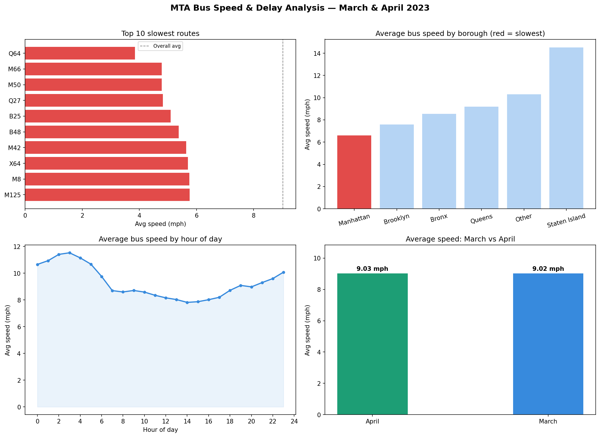

# Day 1: MTA Bus Route Speed & Delay Analyser

**Industry:** Transport / Logistics  
**Format:** Jupyter Notebook  
**Skills:** pandas · matplotlib · groupby · data cleaning · visualisation

## Problem
Transit ops teams manually identify slow routes and delay hotspots.
This notebook automates that analysis using real MTA open data.

## Dataset
MTA Bus Route Segment Speeds — March & April 2023  
Source: data.ny.gov (Official NYC Open Data) — 100,000 rows

## Key Findings
- Slowest route: Q64  (3.85 mph avg)
- Slowest borough: Manhattan  (6.61 mph avg)
- Worst hour of day: 14:00  (7.82 mph avg)
- March vs April: 3:00  (11.53 mph avg)

## Output

## How to run
pip install -r requirements.txt
jupyter notebook analysis.ipynb
