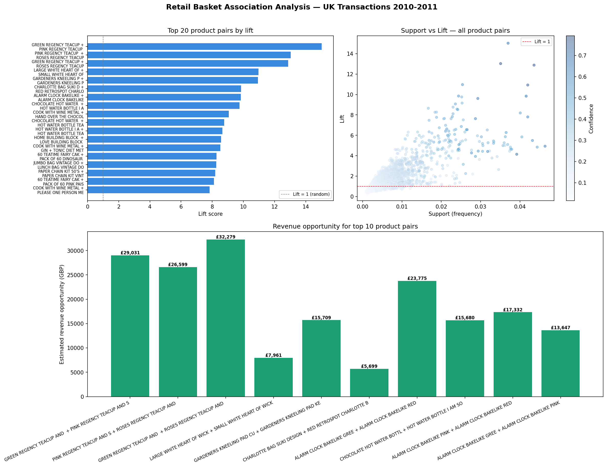

# Day 2: Retail Basket Association Analyser

**Industry:** Retail / E-commerce  
**Format:** Jupyter Notebook  
**Skills:** pandas · numpy · itertools · matplotlib · association rules

## Who uses this
A category manager deciding which products to bundle, co-locate,
or cross-promote — driven by transaction data, not gut feel.

## Problem
Retailers leave cross-sell revenue on the table without basket
analysis. This notebook finds which products are genuinely bought
together using support, confidence, and lift metrics built from scratch.

## Dataset
UCI Online Retail Dataset — 541,909 real UK e-commerce transactions  
Source: archive.ics.uci.edu (no login required)

## Key Findings
- Strongest pair: GREEN REGENCY TEACUP AND SAUCER + PINK REGENCY TEACUP AND SAUCER (lift 15.03x)
- Highest revenue opportunity: GREEN + PINK REGENCY TEACUP AND SAUCER — £29,030.81
- Rules with lift > 2: 655 out of 4,942 total rules
- Recommendation: Bundle all 3 Regency teacup variants as a set

## Business Context
This dataset is a UK wholesale retailer — most customers are small 
shop owners buying stock, not individual consumers. The high lift on 
teacup colour variants (Green/Pink/Roses Regency) reflects customers 
buying the full collection set. This maps directly to 3 actions:
- Bundle the 3 SKUs as a "Regency Collection Set of 3"
- Co-locate all variants on the same shelf/page
- Promote with "buy 2 get 3rd half price" — lift of 15x justifies it

## Output


## How to run
pip install -r requirements.txt
jupyter notebook analysis.ipynb
```

Then commit and push:
```
Day 2: retail basket association analyser — pandas + numpy + lift 15x on teacup pairs