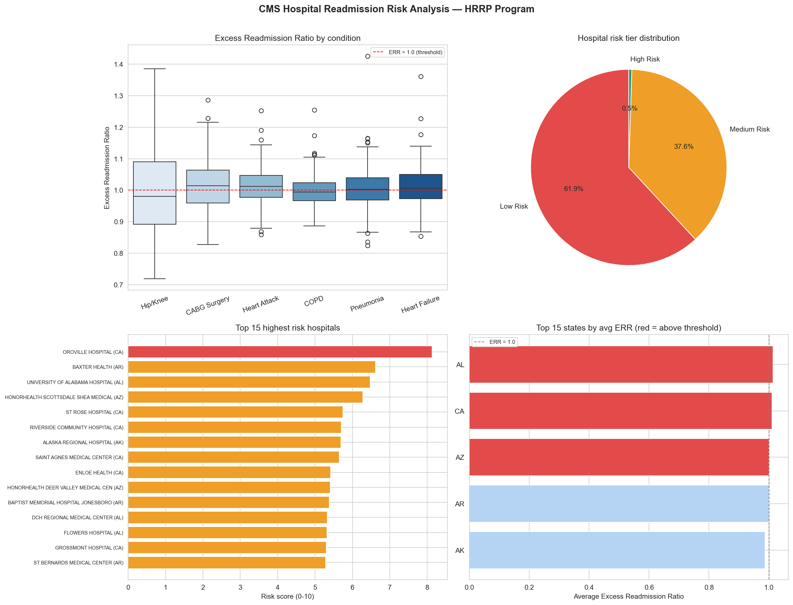

# Day 3: Hospital Readmission Risk Scorer

**Industry:** Healthcare  
**Format:** Jupyter Notebook  
**Skills:** pandas · sqlite3 · SQL · seaborn · matplotlib · scoring model

## Who uses this
A hospital case manager prioritising discharge follow-up calls —
identifying which facilities and conditions have the worst
readmission performance before CMS penalties are applied.

## Problem
Under the CMS Hospital Readmissions Reduction Program (HRRP),
US hospitals are penalised up to 3% of all Medicare payments if
readmission rates exceed expectations. Without a scoring tool,
quality teams manually scan spreadsheets to find problem areas.

## Dataset
CMS Hospital Readmissions Reduction Program — official US government data  
Source: data.cms.gov (no login required)  
1,500 records · 12 columns · hospitals across all US states

## Key Findings
- Hospitals scored: 202
- High risk hospitals: 1 (0.5%) — immediate intervention needed
- Medium risk: 76 | Low risk: 125
- Worst condition: CABG Surgery — avg ERR 1.018 (45 hospitals at risk)
- Top hospital for intervention: OROVILLE HOSPITAL, CA
  - Risk score: 8.13/10 | Avg ERR: 1.248 | 5 conditions at risk
- Worst state: Alabama — avg ERR 1.014 across 67 hospitals

## How the risk score works
Composite score combining:
- ERR score (50% weight) — how far above 1.0 is their ratio?
- Breadth score (30% weight) — how many conditions are underperforming?
- Volume score (20% weight) — patient volume at risk

CMS penalty threshold: ERR > 1.0 triggers up to 3% payment reduction

## Output


## How to run
```bash
pip install -r requirements.txt
jupyter notebook analysis.ipynb
```