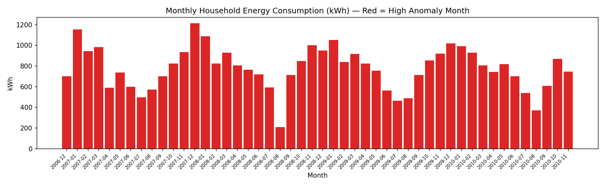
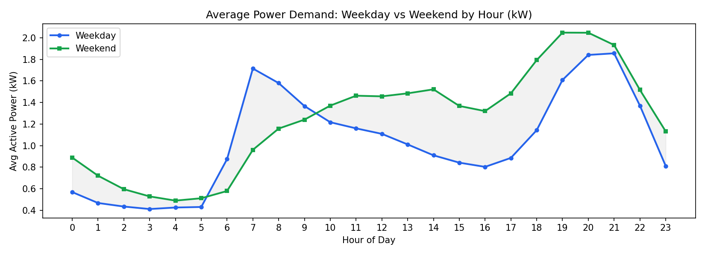

# Day 04: Smart Meter Energy ETL Pipeline

**Industry:** Energy / Utilities  
**Format:** Python Script (.py)  
**Skills:** pandas · sqlite3 · matplotlib · ETL pipeline · anomaly detection

**Data:** UCI Household Power Consumption — 2,049,280 minute-level smart meter readings from a real French household (2006–2010)

---

## Who uses this
A **utility data engineer or energy analyst** who needs raw smart meter flat files cleaned, enriched, and loaded into a queryable database — so operations teams can detect waste, flag anomalies, and report on consumption patterns without touching the raw CSV.

## Problem
Smart meters generate millions of minute-level readings as messy flat files with missing values, inconsistent formats, and no derived metrics. Without a pipeline, analysts can't answer basic questions: when is peak demand? which appliances consume the most? what readings are anomalous? This script automates the full Extract → Transform → Load cycle and answers those questions immediately.

## What this does
1. **Extract** — loads 2M+ rows from raw semicolon-delimited meter file, handles `?` missing values
2. **Transform** — parses datetime, casts numeric columns, engineers energy (kWh), anomaly flag (3σ), weekend/weekday split
3. **Load** — writes clean data to SQLite with 3 analytical views (monthly summary, hourly profile, sub-meter breakdown)
4. **Insight** — prints a business insight summary with findings and recommendations

## Key Findings
- Dataset span: 2006-12-16 → 2010-11-26 | 2,049,280 readings | 37,284 kWh total
- Peak demand at **20:00** — shift high-draw appliances off-peak to reduce bills and grid stress
- **1,004 kWh seasonal swing** between December (1,210 kWh) and August (206 kWh) — confirms heavy winter heating load
- **36,160 anomalous readings** (1.76%) flagged — review for faulty appliances or meter faults
- Untracked consumption (63.7 kWh) exceeds HVAC sub-meter (55.2 kWh) — further metering on lighting circuits recommended

## Output



## How to run
```bash
pip install -r requirements.txt
python etl_pipeline.py
```

The script downloads nothing — point it at your own `household_power_consumption.txt` file.  
Download dataset: https://archive.ics.uci.edu/dataset/235/individual+household+electric+power+consumption
```


```
