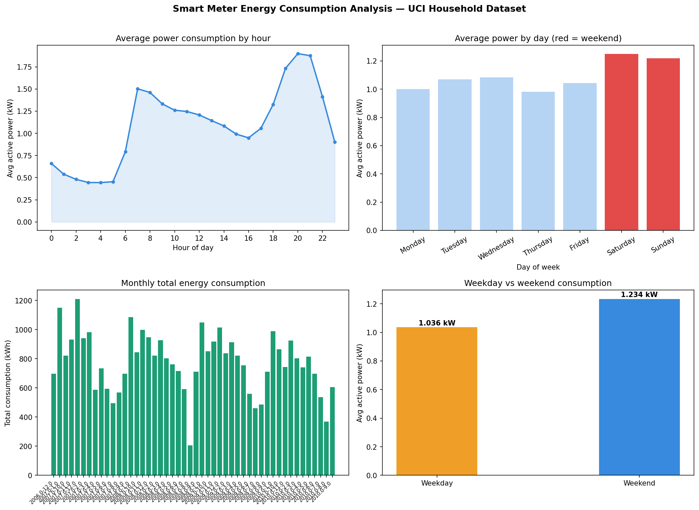

# Day 4: Smart Meter Energy ETL Pipeline

**Industry:** Energy / Utilities  
**Format:** Python script (.py)  
**Skills:** ETL · pandas · sqlite3 · chunked processing · data validation · matplotlib

## Who uses this
An energy analyst running weekly consumption reports from raw meter 
data. This pipeline takes 2M+ rows of messy minute-level readings 
and produces a clean, queryable SQLite database with hourly 
aggregations ready for analysis.

## Problem
Raw smart meter data arrives as large, semicolon-separated files 
with missing values, wrong types, and no structure. Without a 
pipeline, analysts waste hours cleaning data manually before any 
analysis can begin.

## ETL Pattern
- **Extract** — loads 2,075,259 rows in chunks of 100k (memory efficient)
- **Transform** — cleans nulls, fixes types, engineers features, resamples to hourly
- **Load** — writes clean data into SQLite (34,168 hourly records)
- **Validate** — 4 SQL integrity checks, all passing

## Dataset
UCI Individual Household Electric Power Consumption  
Source: archive.ics.uci.edu — real minute-level readings 2006–2010  
4 years of data · 2,075,259 raw rows · 9 columns

## Key Findings
- Total energy consumed: 37,284 kWh across 48 months
- Peak consumption hour: 20:00 — highest household demand
- Lowest consumption hour: 04:00 — best window for EV charging
- Peak month: December 2007 — winter heating demand
- Weekend consumption is 19.1% higher than weekday
- Pipeline runs end-to-end in 29.9s — schedulable via cron job

## Output


## How to run
```bash
pip install -r requirements.txt
python etl_pipeline.py
```

## Pipeline output files
- `smart_meter.db` — SQLite database with hourly_consumption and monthly_summary tables
- `consumption_analysis.png` — 4-panel consumption chart
- `output/consumption_by_hour.csv`
- `output/consumption_by_day.csv`
- `output/monthly_consumption.csv`
```
