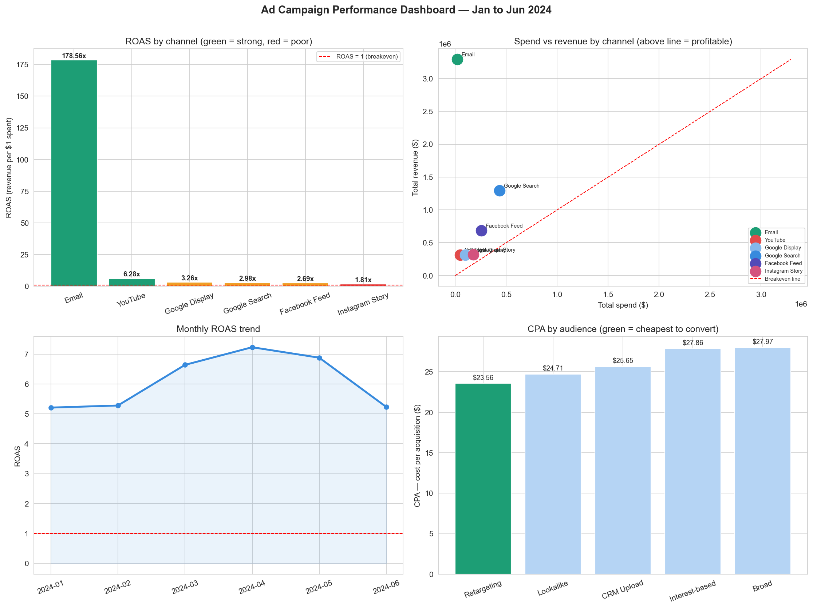

# Day 5: Ad Campaign SQL Performance Dashboard

**Industry:** Marketing  
**Format:** Jupyter Notebook  
**Skills:** pandas · sqlite3 · SQL · matplotlib · seaborn · marketing metrics

## Who uses this
A performance marketing manager deciding how to reallocate next 
month's budget across channels — without manually exporting and 
merging CSVs from Google Ads, Facebook, and Email platforms.

## Problem
Marketing teams overspend on high-CPA channels because they lack 
a fast unified SQL view of cross-channel performance. This notebook 
replicates what analysts build in Looker Studio — in pure Python + SQL.

## Dataset
Synthetic campaign data mirroring real Google Ads / Facebook Ads 
Manager export structure — 1,092 rows, 6 channels, 6 months (Jan–Jun 2024)

## Metrics calculated
CTR · CPC · CPA · ROAS · ROI — all built from scratch without external libraries

## Key Findings
- Overall ROAS: 6.04x on $1,030,333 spend → $6,221,572 revenue
- Best channel: Email — ROAS 178.56x, CPA $1.12
- Worst channel: Instagram Story — ROAS 1.81x (borderline breakeven)
- Best campaign: Product Launch — ROAS 8.14x
- Best audience: Retargeting — lowest CPA at $23.56
- Best day: Tuesday — avg ROAS 44.5x

## Budget Reallocation Recommendation
1. Scale Email — highest ROAS at 178.56x
2. Reduce Instagram Story budget — lowest ROAS at 1.81x
3. Prioritise Retargeting audience — cheapest conversions
4. Increase spend on Tuesdays — best avg ROAS of the week

## Output

## How to run
pip install -r requirements.txt
jupyter notebook analysis.ipynb

