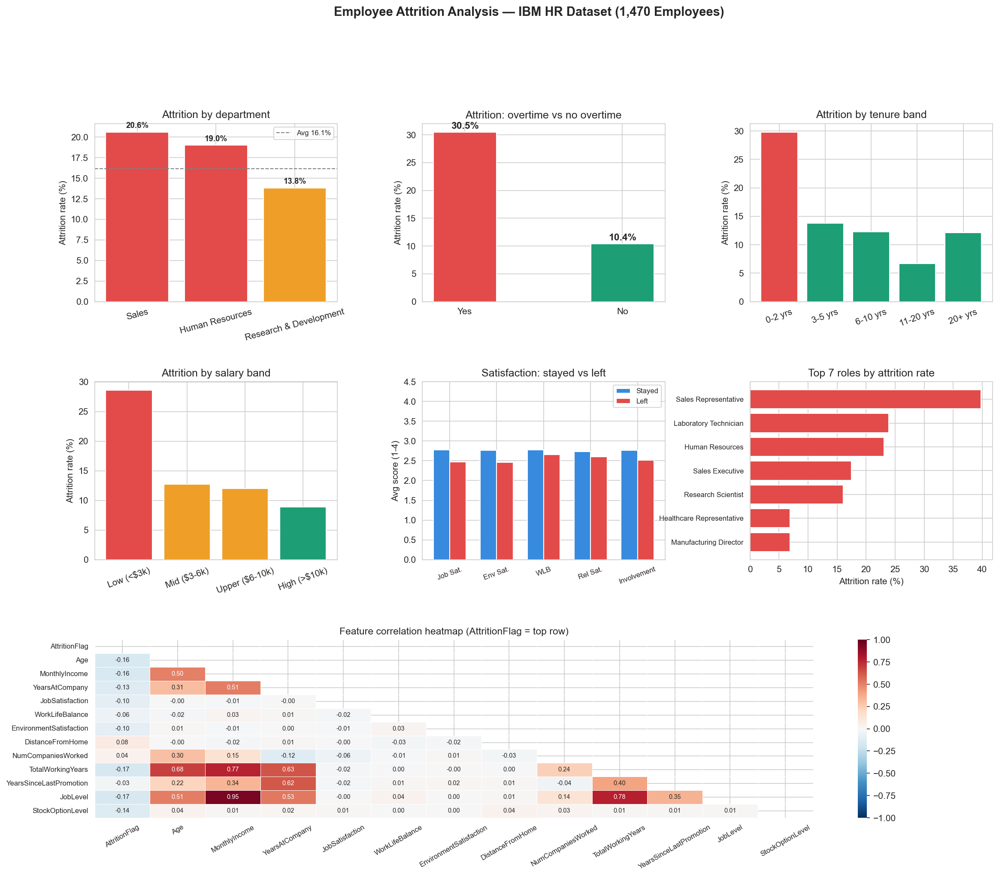

# Day 6: Employee Attrition Pattern Analyser

**Industry:** HR / Recruitment  
**Format:** Jupyter Notebook  
**Skills:** pandas · seaborn · matplotlib · numpy · scoring model · business metrics

## Who uses this
An HR director deciding where to focus retention programmes — 
surfacing attrition patterns months before people resign.

## Problem
Replacing an employee costs 1.5x their annual salary. With a 16% 
attrition rate across 1,470 employees, that is $20M+ in preventable 
annual cost. This notebook identifies exactly which departments, 
roles, and conditions drive that attrition.

## Dataset
IBM HR Analytics Employee Attrition Dataset  
1,470 employees · 35 features · official IBM open dataset

## Key Findings
- Overall attrition rate: 16.1%
- Total estimated turnover cost: $20,421,738
- Highest risk department: Sales — 20.6% attrition rate
- Highest risk role: Sales Representative — 39.8% attrition rate
- Overtime effect: 30.5% attrition (overtime) vs 10.4% (no overtime)
- Employees flagged for immediate intervention: 278

## Top 3 Retention Recommendations
1. Reduce overtime burden — nearly triples attrition risk (30.5% vs 10.4%)
2. Audit Sales department — 20.6% rate, highest across all departments
3. Review compensation for low salary band — highest flight risk group

## Output

## How to run
pip install -r requirements.txt
jupyter notebook analysis.ipynb

