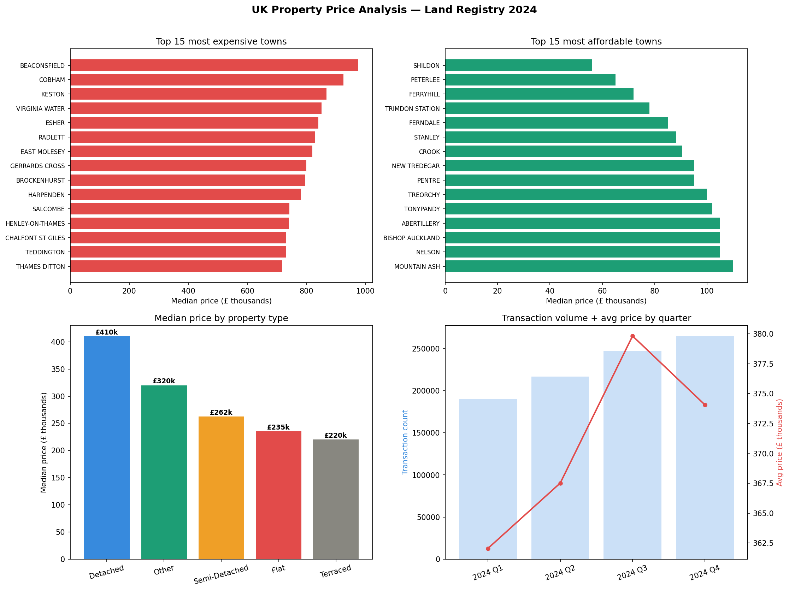

# Day 8: UK Property Price ETL + Trend Analysis

**Industry:** Real Estate  
**Format:** Python script (.py)  
**Skills:** ETL · pandas · sqlite3 · matplotlib · data validation

## Who uses this
A property investor comparing area price trends before making
purchase decisions. Transforms 920k raw Land Registry transactions
into clean area-level analysis in under 40 seconds.

## Dataset
UK Land Registry Price Paid Data 2024  
Source: landregistry.gov.uk (official UK government open data)  
923,729 raw rows · 16 columns · full year 2024

## ETL Summary
- Extract: 923,729 rows loaded in 4s
- Transform: cleaned, enriched, engineered features
- Load: 919,714 rows into SQLite + monthly summary table
- Validate: 4/4 integrity checks passed

## Key Findings
- National median price: £280,000
- Total market value: £341,749,147,430
- Most expensive town: BEACONSFIELD — £975,000 median
- Most affordable town: SHILDON — £56,125 median
- New build premium: 20.4% above existing properties
- Detached homes most expensive: £410,000 median
- Terraced homes most affordable: £220,000 median

## Investor Recommendation
- Target SHILDON for entry-level yield plays
- Avoid new builds — 20.4% premium with no rental yield advantage

## Output


## How to run
```bash
pip install -r requirements.txt
python etl_pipeline.py
```
