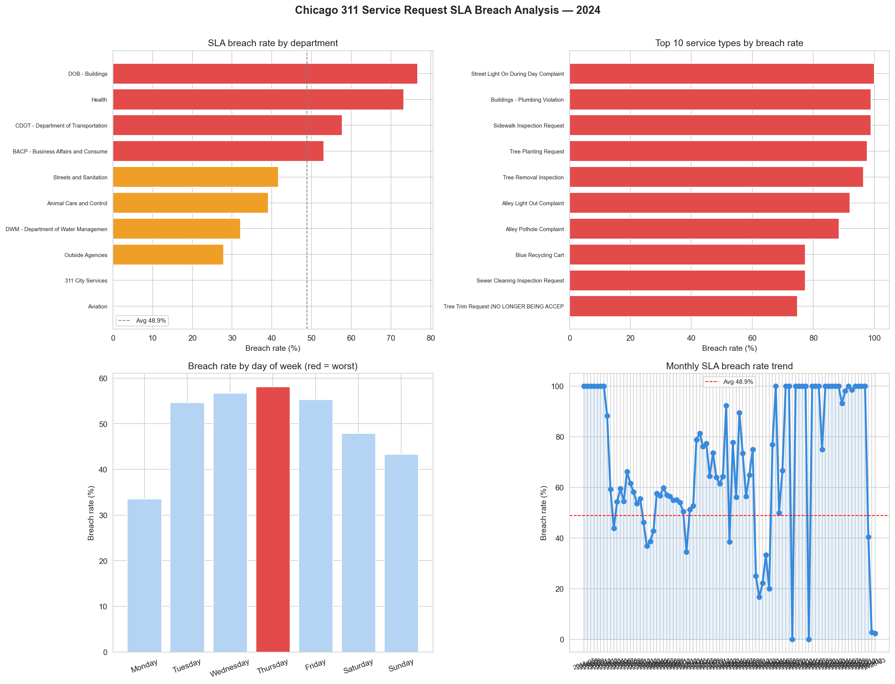

# Day 9: Government Service SLA Breach Detector

**Industry:** Transport / Logistics / Government Operations  
**Format:** Jupyter Notebook  
**Skills:** pandas · numpy · matplotlib · seaborn · datetime · SLA analysis

## Who uses this
A city operations manager identifying which departments and service 
types are consistently breaching response SLAs — to reallocate 
resources and reduce complaint backlogs.

## Problem
City governments receive thousands of service requests daily. Without 
automated breach detection, managers only discover failures when 
complaints escalate. This notebook detects breaches, quantifies 
citizen impact in excess wait-days, and ranks departments by 
performance.

## Dataset
Chicago 311 Service Requests — official City of Chicago open data  
Source: data.cityofchicago.org — 50,000 real requests, 2024  
No login required · updated daily

## Note on SLA thresholds
SLA thresholds are estimated based on publicly available Chicago 
service level guidelines. Official targets vary by request type and 
may differ from these estimates.

## Key Findings
- Requests analysed: 45,393 closed requests
- Overall breach rate: 48.9%
- Total excess citizen wait-days: 1,554,937
- Avg excess per breach: 70.1 days
- Worst department: DOB - Buildings (76.7% breach rate)
- Critical breaches exceeding 2x SLA: 500
- Best day to submit a request: Monday (33.5% breach rate)
- Worst day: Thursday (58.1% breach rate)

## Recommendations
1. Prioritise DOB - Buildings — 76.7% breach rate
2. Increase Monday processing capacity — lowest breach rate suggests
   requests submitted early week get better service
3. 500 requests exceeded 2x SLA — escalate immediately
4. Review SLA targets for Buildings dept — 47.8 avg days suggests
   targets may need adjustment

## Output

## How to run
pip install -r requirements.txt
jupyter notebook analysis.ipynb
