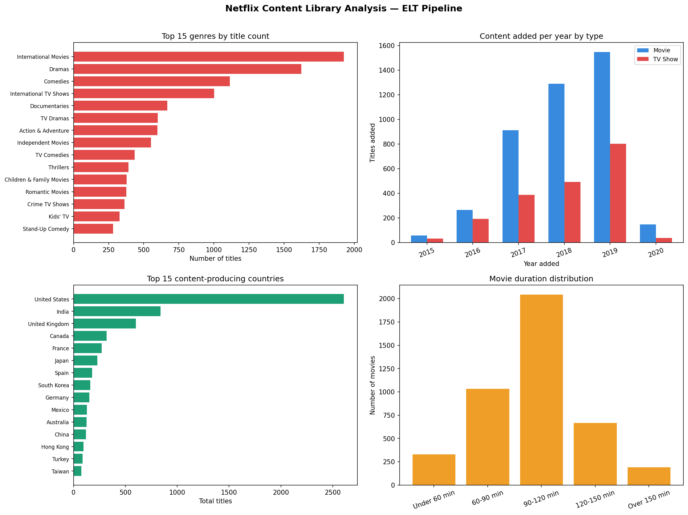

# Day 10: Streaming Platform Content ELT Pipeline

**Industry:** Media / Entertainment  
**Format:** Python script (.py)  
**Skills:** ELT · pandas · sqlite3 · SQL views · matplotlib

## Who uses this
A content acquisition manager deciding which genres and countries
to commission next — based on what the current library is missing
or over-indexed on.

## Problem
Raw streaming catalogue data is messy and unstructured. Without a
pipeline, analysts manually clean and query CSV files. This ELT
pipeline loads raw data first, then transforms via SQL views —
the same pattern used in BigQuery, Snowflake, and Redshift.

## ELT vs ETL
- **ETL** — transform before loading (traditional)
- **ELT** — load raw first, transform with SQL views in-place
- No data duplication — views query the raw table directly
- Transformations are version-controlled SQL, not buried in scripts

## Dataset
Netflix Movies and TV Shows — 6,234 titles, 12 columns  
Source: github.com/prasertcbs/basic-dataset (CC0 Public Domain)

## Key Findings
- Total titles: 6,234 (68.4% Movies, 31.6% TV Shows)
- Top genre: International Movies (1,927 titles)
- Top producing country: United States (2,032 titles)
- Movie sweet spot: 90-120 mins (2,044 movies)
- TV Shows underrepresented at 31.6% — retention opportunity

## SQL Views Created
- `v_content_clean` — cleaned and typed titles
- `v_genre_performance` — genre stats with avg movie duration
- `v_country_performance` — production volume by country

## Content Acquisition Recommendations
1. International Movies is the dominant genre — diversify into
   under-served genres to reduce concentration risk
2. India is 2nd largest producer (777 titles) — strong pipeline
3. South Korea and Japan lead in TV Shows relative to output
4. Increase TV Show commissioning — drives subscriber retention

## Output


## How to run
```bash
pip install -r requirements.txt
python elt_pipeline.py
```
