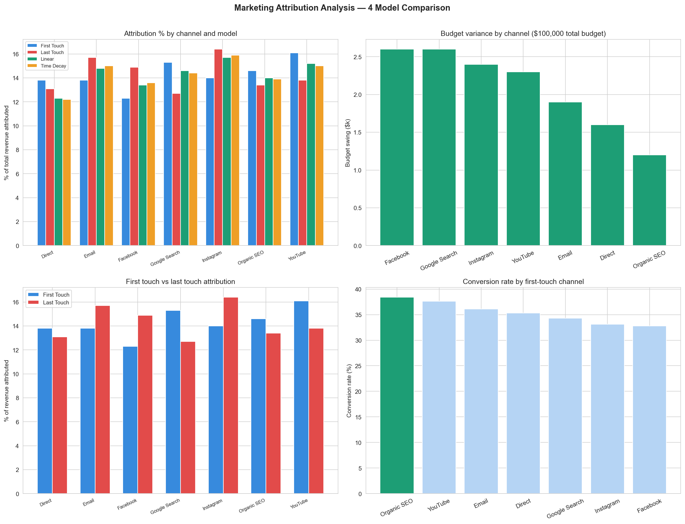

# Day 11: Marketing Attribution Analyser

**Industry:** Marketing  
**Format:** Jupyter Notebook  
**Skills:** pandas · numpy · matplotlib · attribution modelling

## Who uses this
A marketing director deciding which channels to scale next quarter
— without being misled by last-click attribution.

## Problem
Last-click attribution (Google Ads default) gives 100% credit to
the final touchpoint, systematically defunding awareness channels
that start the customer relationship. This analysis shows how
budget allocation shifts across 4 attribution models.

## Models built from scratch
- **First-touch** — 100% credit to first channel
- **Last-touch** — 100% credit to last channel (industry default)
- **Linear** — equal credit across all touchpoints
- **Time-decay** — more credit closer to conversion

## Data
Synthetic customer journey data — 2,000 customers, 6,978 touchpoints  
Mirrors exact structure of real GA4 / Adobe Analytics exports.  
Real multi-touch data is commercially sensitive and never public.

## Key Findings
- Customers analysed: 2,000 | Converted: 708
- Total revenue: $81,034
- Avg touchpoints to convert: 3.5
- First-touch winner: YouTube (16.1%)
- Last-touch winner: Instagram (16.4%)
- Highest conversion rate as first channel: Organic SEO (38.4%)
- Most budget-volatile channel: Facebook ($2,600 swing across models)
- Switching to linear: Google Search gains +1.9%, Facebook loses -1.5%

## Key Insight
Organic SEO drives the highest conversion rate (38.4%) when it is
the first channel — but last-touch attribution chronically under-
credits it. Brands relying on last-click are systematically
underfunding their best awareness channel.

## Output


## How to run
```bash
pip install -r requirements.txt
python generate_data.py
jupyter notebook analysis.ipynb
```