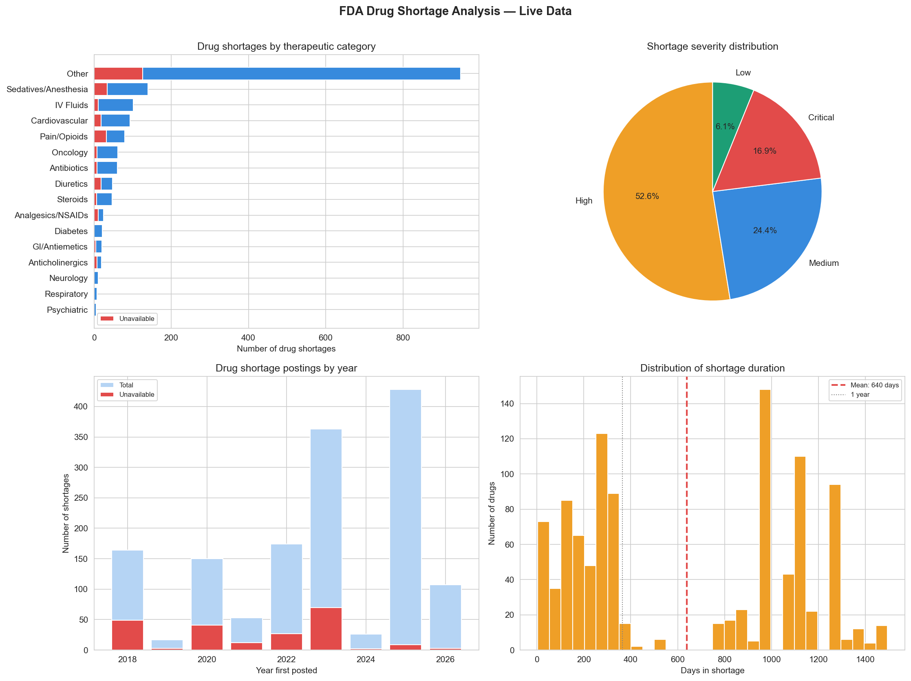

# Day 12: Pharmacy Stock Alert System

**Industry:** Healthcare  
**Format:** Jupyter Notebook  
**Skills:** pandas · matplotlib · seaborn · REST API · JSON parsing · alerting

## Who uses this
A pharmacy manager doing their daily stock review — pulling live
FDA shortage data, classifying by severity, and getting a
prioritised alert list ready to act on without manual checking.

## Problem
Drug shortages cause patient harm. The FDA publishes shortage data
daily but most pharmacies have no automated way to monitor it.
This notebook replaces a manual daily FDA website check with a
live data pipeline and ranked alert list.

## Data
FDA Drug Shortage Database — live REST API, no login required  
Source: api.fda.gov  
1,693 records pulled · updated continuously by FDA

## Note on Available vs Unavailable for same drug
Each row is a specific manufacturer's supply — not the drug itself.
Multiple manufacturers supply the same drug, each with their own
shortage status. Fentanyl from Manufacturer A may be unavailable
while Fentanyl from Manufacturer B is available. This is how the
FDA tracks shortages — per manufacturer, not per drug name.

## Key Findings
- Total shortage records: 1,693
- Active shortages: 1,028
- Unavailable drugs: 286 — source alternatives immediately
- Avg shortage duration: 1,480 days
- Critical shortages: 286
- High severity: 890
- Longest running: Fentanyl Citrate Injection — 5,207 days
- Most affected categories: Pain/Opioids, Sedatives/Anesthesia,
  Oncology — highest unavailability rates

## Severity Classification
- **Critical** — Unavailable status
- **High** — To Be Discontinued or shortage >365 days
- **Medium** — Shortage 90-365 days
- **Low** — Shortage <90 days

## Recommendations
1. 286 critical shortages — source alternatives immediately
2. 890 high severity — review stock and place orders
3. Pain/Opioids and Sedatives have highest unavailability rates
4. Run notebook daily — FDA data updates continuously

## Output


## How to run
```bash
pip install -r requirements.txt
jupyter notebook analysis.ipynb
```