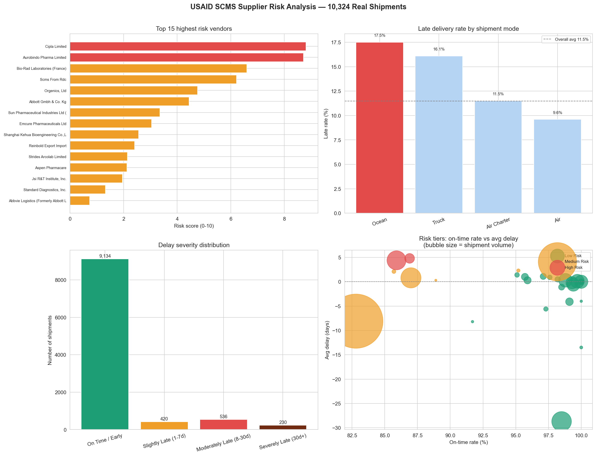

# Day 13: Supply Chain Supplier Risk Ranker

**Industry:** Transport / Logistics  
**Format:** Jupyter Notebook  
**Skills:** pandas · numpy · matplotlib · seaborn · scoring model · datetime

## Who uses this
A procurement manager deciding which supplier relationships to
review this quarter — replacing subjective Excel rankings with
an auditable, repeatable composite risk score.

## Dataset
USAID SCMS Delivery History — 10,324 real health commodity shipments  
Source: USAID Supply Chain Management System — public domain  
Covers HIV/AIDS medicine procurement to developing countries 2006-2015

## Risk Score Methodology
Composite score 0-10 combining:
- On-time rate (50% weight)
- Severe delay rate — shipments 30+ days late (30% weight)
- Average delay days (20% weight)

## Key Findings
- Overall late rate: 11.5%
- Highest risk vendor: Cipla Limited
- High risk vendors flagged: 2
- Worst shipment mode: Ocean — 17.5% late rate
- Best shipment mode: Air — 9.6% late rate

## Recommendations
1. Audit Cipla Limited — highest composite risk score
2. Avoid Ocean freight where possible — 17.5% late rate vs 9.6% Air
3. 2 vendors flagged High Risk — renegotiate SLAs or find alternatives

## Output


## How to run
```bash
pip install -r requirements.txt
jupyter notebook analysis.ipynb
```