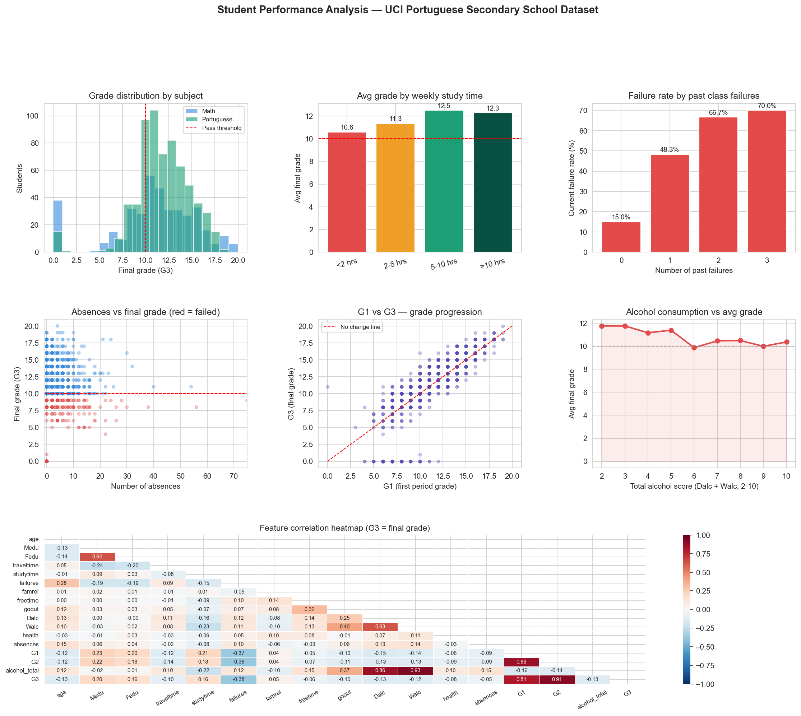

# Day 15: Edtech Student Performance Visualiser

**Industry:** Education / Edtech  
**Format:** Jupyter Notebook  
**Skills:** pandas · seaborn · matplotlib · GridSpec · correlation · risk scoring

## Who uses this
A school principal deciding where to allocate tutoring resources —
surfacing systemic patterns across 1,044 students rather than
reviewing individual grade sheets.

## Problem
Teachers have grade data but no visual way to spot learning gaps
across cohorts. Warning signs in G1 and G2 often go unnoticed
until a student fails the final grade.

## Dataset
UCI Student Performance Dataset — real Portuguese secondary school  
Source: archive.ics.uci.edu (CC0 public domain)  
395 Math students + 649 Portuguese students · 33 features

## Key Findings
- Overall failure rate: 22.0%
- Math failure rate: 32.9% vs Portuguese: 15.4%
- Strongest G3 predictor: G2 period grade (r=0.911)
- Study time impact: +1.7 grade points (<2 hrs vs >10 hrs/week)
- Alcohol impact: highest consumers avg 10.4 vs lowest 11.8
- At-risk students flagged: 270 (193 already failing)

## Key Insight
Math failure rate is more than double Portuguese (32.9% vs 15.4%).
G2 period grade is the strongest predictor of final outcome (r=0.911)
— meaning intervention after Period 2 results is the highest-leverage
moment for a teacher to act.

## Recommendations
1. 270 students flagged for tutoring — prioritise the 193 already failing
2. Intervene after G2 results — strongest signal for final grade
3. Target repeat-failure students earliest — past failures strongest risk factor
4. Focus Math remedial resources — failure rate more than 2x Portuguese

## Output


## How to run
```bash
pip install -r requirements.txt
jupyter notebook analysis.ipynb
```