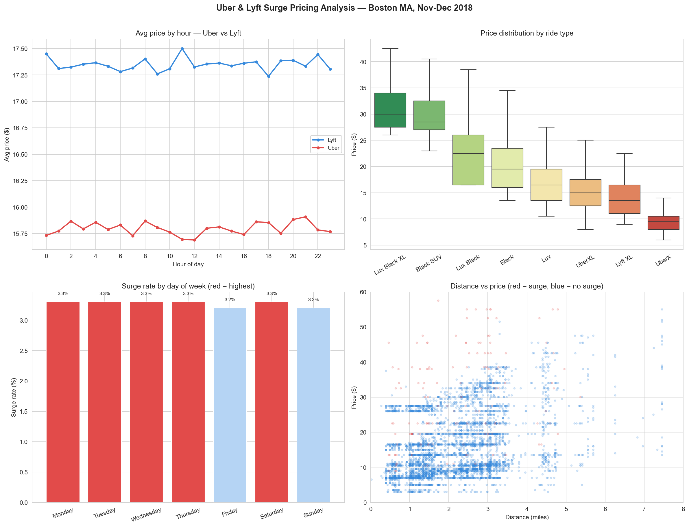

# Day 16: Uber & Lyft Surge Pricing Analyser

**Industry:** Retail / E-commerce / Transport  
**Format:** Jupyter Notebook  
**Skills:** pandas · numpy · matplotlib · seaborn · datetime · pricing analysis

## Who uses this
A pricing analyst at a ride-hailing company understanding when and
where surge pricing fires, which ride types command premium prices,
and how surge revenue contributes to total platform revenue.

## Dataset
Real Uber & Lyft ride data — Boston, MA — November/December 2018  
Source: Collected via Uber & Lyft APIs (Kaggle)  
693,071 raw rides · 637,976 after cleaning · 10 columns

## Key Findings
- Total rides analysed: 637,976
- Uber rides: 330,568 | Lyft rides: 307,408
- Uber avg price: $15.80 vs Lyft avg: $17.35 (+$1.55 gap)
- Most expensive ride type: Lux Black XL ($32.32 avg)
- Cheapest ride type: Shared ($6.03 avg)
- Surge ride %: 3.3% of all rides
- Max surge multiplier: 3.0x
- Peak surge hour: 13:00 (3.9% surge rate)
- Peak surge day: Monday (3.3% surge rate)
- Surge revenue: $183,234 (1.7% of total revenue)
- Most expensive route: Financial District → Boston University
- Highest surge route: Back Bay → Boston University

## Key Insight
Lyft charges $1.55 more on average than Uber across all ride types.
Despite a higher base price, Lyft's surge rate matches Uber's —
suggesting Lyft relies more on base pricing than surge to capture
revenue, while Uber competes on lower base price.

## Recommendations
1. Surge only fires on 3.3% of rides — scope to increase surge
   sensitivity during peak demand windows
2. Monday peak suggests commuter demand — driver bonuses on Monday
   mornings would reduce surge and improve rider experience
3. Lyft's $1.55 price premium is a churn risk if Uber improves
   service quality

## Output


## How to run
```bash
pip install -r requirements.txt
jupyter notebook analysis.ipynb
```