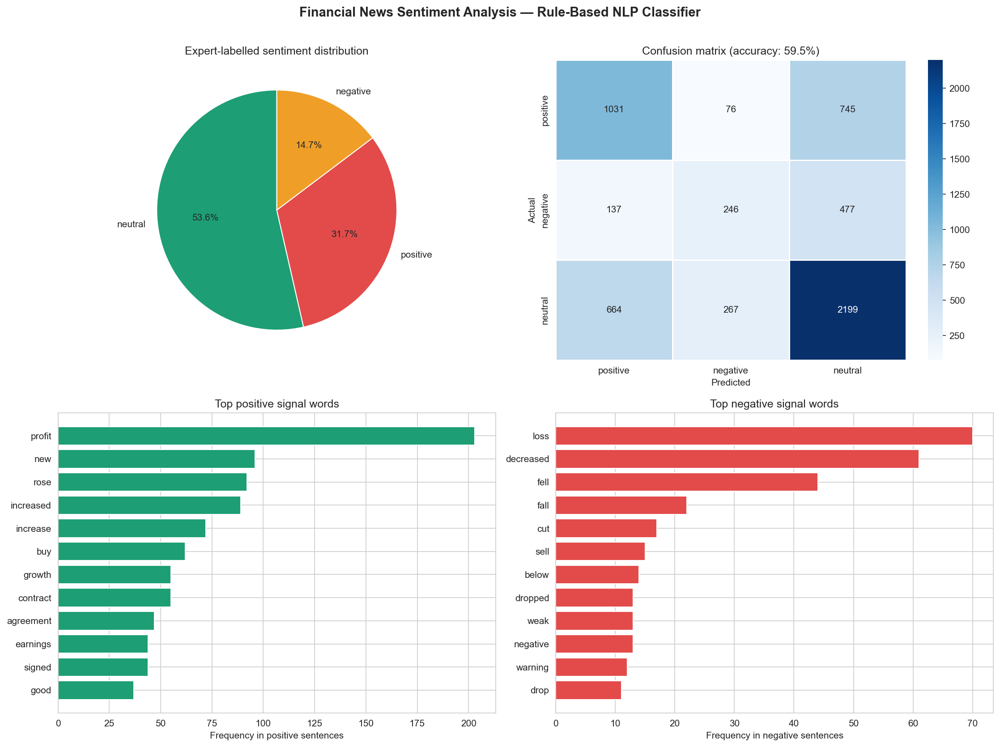

# Day 17: Financial News Sentiment Analyser

**Industry:** Finance / Fintech  
**Format:** Jupyter Notebook  
**Skills:** pandas · matplotlib · seaborn · NLP · regex · rule-based classifier

## Who uses this
A quantitative analyst screening financial news automatically —
flagging negative sentiment on held positions before prices move.

## Problem
Analysts read hundreds of headlines daily. Manual sentiment screening
is slow and inconsistent. A rule-based classifier gives a fast,
auditable first pass — surfacing the most negative and positive news
for human review.

## Dataset
Financial PhraseBank + FiQA — expert-labelled financial sentences  
Source: mayankpujara/Financial-Sentiment-Analysis (GitHub)  
5,842 sentences · labelled by finance domain experts

## Approach
Rule-based lexicon classifier with negation handling —
mirrors the Loughran-McDonald Financial Sentiment Dictionary,
the industry standard for financial NLP. No ML training required.
Interpretable, fast, and auditable.

## Key Findings
- Total sentences: 5,842 (53.6% neutral, 31.7% positive, 14.7% negative)
- Overall accuracy: 59.5% vs expert labels
- Positive accuracy: 55.7%
- Negative accuracy: 28.6% — hardest class (subtle language)
- Neutral accuracy: 70.3%
- High confidence predictions: 510 (net score ≥ 2)
- Top positive signal: "profit" (203 hits)
- Top negative signal: "loss" (70 hits)

## Why 59.5% matters
Rule-based classifiers are the interpretable baseline before
deploying FinBERT or GPT-based models. They run in milliseconds,
require no GPU, and produce auditable decisions — essential in
regulated financial contexts. BERT-based models achieve 85%+ but
are black boxes. This is a transparent starting point.

## Output


## How to run
```bash
pip install -r requirements.txt
jupyter notebook analysis.ipynb
```