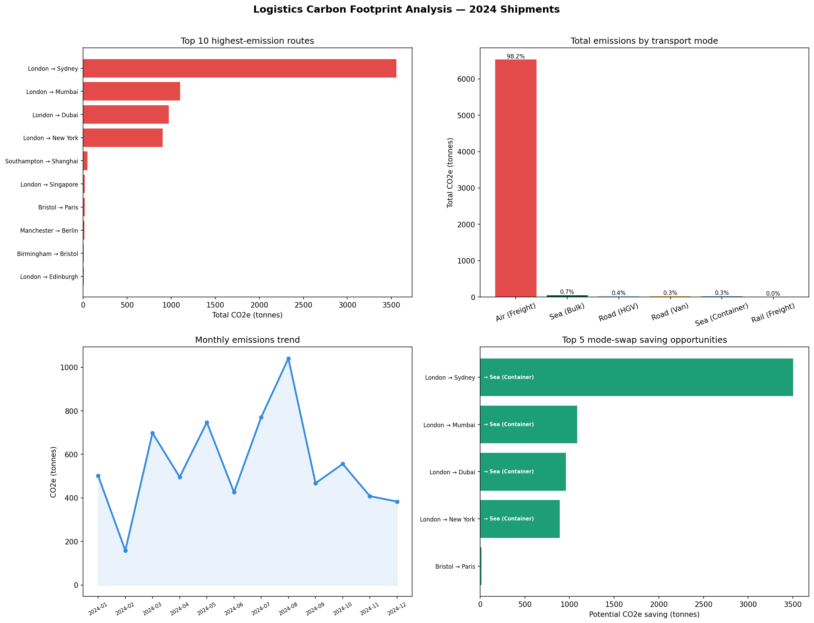

# Day 17: Logistics Carbon Footprint ETL

**Industry:** Transport / Logistics  
**Format:** Python script (.py)  
**Skills:** ETL · pandas · sqlite3 · matplotlib · carbon accounting

## Who uses this
A sustainability manager building a quarterly ESG carbon report —
processing the full shipment ledger to identify highest-emission
routes and mode-swap opportunities.

## Problem
ESG reporting requires shipment-level carbon data. Most logistics
teams calculate this manually in spreadsheets per route. This
pipeline processes all shipments at once and outputs ranked
recommendations automatically.

## Emissions Factors
UK Government BEIS 2023 GHG Conversion Factors (embedded)
Unit: kg CO2e per tonne-km by transport mode

| Mode | kg CO2e / tonne-km |
|------|--------------------|
| Air (Freight) | 0.8020 |
| Road (Van) | 0.2073 |
| Road (HGV) | 0.0626 |
| Rail (Freight) | 0.0280 |
| Sea (Container) | 0.0113 |
| Sea (Bulk) | 0.0078 |

## Key Findings
- Total shipments: 708 | Total CO2e: 6,653.9 tonnes
- Air freight = 98.2% of all emissions despite not being highest volume
- Highest emission route: London → Sydney (3,556 tonnes CO2e)
- Potential saving: 6,481.6 tonnes CO2e (97.4%) by switching Air → Sea
- Bristol → Paris: Road Van → Rail saves 14.8 tonnes

## Top Recommendations
1. London → Sydney: Switch Air → Sea Container — save 3,506 tonnes
2. London → Mumbai: Switch Air → Sea Container — save 1,085 tonnes
3. London → Dubai: Switch Air → Sea Container — save 959 tonnes

## Output


## How to run
```bash
pip install -r requirements.txt
python etl_pipeline.py
```