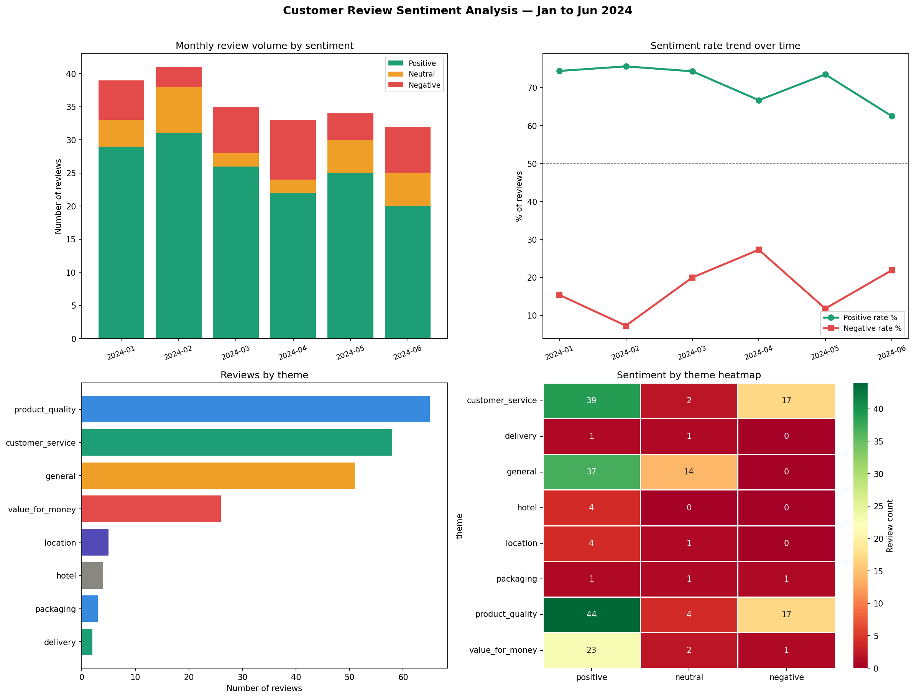

# Day 18: Customer Review Sentiment ETL Pipeline

**Industry:** Marketing / Retail  
**Format:** Python script (.py)  
**Skills:** ETL · pandas · Groq API · LLaMA 3.1 · sqlite3 · matplotlib · JSON parsing

## Who uses this
A CX manager presenting the weekly voice-of-customer report
to leadership — without reading 200 reviews manually.

## Problem
CX teams read reviews one by one with no systematic way to
track sentiment trends at scale. This pipeline tags every
review with sentiment, theme, and urgency using AI — then
stores results in SQLite and visualises the trend over time.

## Data
TripAdvisor Hotel Reviews — real guest reviews  
200 reviews sampled · processed via Groq API (LLaMA 3.1 8B)

## Pipeline
1. **Extract** — load real TripAdvisor reviews, sample 200
2. **Transform** — batch-send to LLaMA 3.1 via Groq API  
   Each review tagged with: sentiment · theme · urgency · key phrase
3. **Load** — insert tagged reviews into SQLite (3 tables)
4. **Visualise** — monthly sentiment trend dashboard

## Key Findings
- Total reviews tagged: 214 (200 sampled + fallback retries)
- Positive: 153 (71.5%) | Neutral: 25 (11.7%) | Negative: 36 (16.8%)
- High urgency reviews flagged: 54
- Best month: February 2024 (75.6% positive rate)
- Worst month: April 2024 (27.3% negative rate)
- Top complaint themes: customer service (17) · product quality (17)

## CX Recommendations
1. Address 54 high-urgency negative reviews immediately
2. Investigate April 2024 — highest negative rate of the period
3. Focus on customer service and product quality — equal top complaints
4. Run weekly — early warning before sentiment trends worsen

## Output


## Setup
```bash
pip install -r requirements.txt
# Get free API key from console.groq.com
$env:GROQ_API_KEY = "your-key-here"
python etl_pipeline.py
```