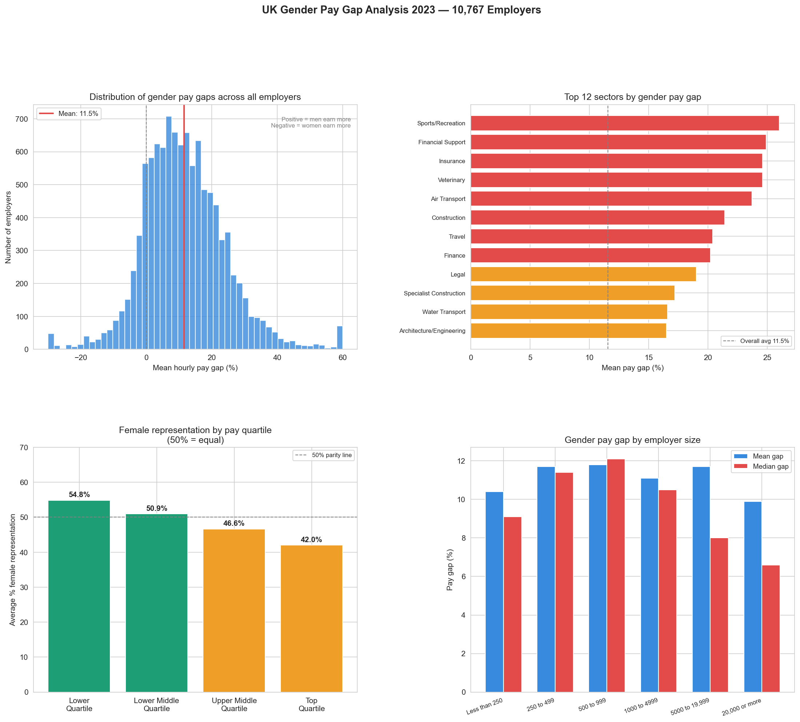

# Day 19: HR Pay Equity Analyser

**Industry:** HR / Recruitment  
**Format:** Jupyter Notebook (.ipynb)  
**Skills:** pandas · seaborn · matplotlib · equity analysis · government data

## Who uses this
An HR director preparing for a pay equity audit or board presentation — processing 10,767 real UK employer submissions to benchmark gaps by sector, size, and quartile representation.

## Problem
Pay equity audits are legally required in the UK for employers with 250+ staff
. Without analysis tooling, HR teams manually review spreadsheets
. This notebook automates gap detection, sector benchmarking, and quartile representation analysis.

## Dataset
UK Gender Pay Gap Service 2023 — official UK government data  
10,767 employer submissions · direct CSV download, no login  
Source: gender-pay-gap.service.gov.uk

## Key Findings
- Overall mean pay gap: 11.5% (men earn more)
- Overall median pay gap: 11.1%
- 14.4% of employers — women actually earn more
- Worst sector: Sports/Recreation (26.0% mean gap)
- Best sector: Security (1.5% mean gap)
- 5,616 employers (52.2%) above 10% audit threshold

## Glass Ceiling Evidence
Female representation drops at every pay level:

| Quartile | Female % |
|----------|----------|
| Lower Quartile | 54.8% |
| Lower Middle | 50.9% |
| Upper Middle | 46.6% |
| Top Quartile | 42.0% |

Women are overrepresented at the bottom and underrepresented
at the top — consistent with occupational segregation.

## Gap Severity Breakdown
- Severe (>20%): 2,417 employers (22.4%)
- High (10-20%): 3,199 employers (29.7%)
- Moderate (0-10%): 3,547 employers (32.9%)
- Women earn more: 1,549 employers (14.4%)

## Output


## How to run
```bash
pip install -r requirements.txt
python download.py      # fetches data from gov.uk
jupyter notebook analysis.ipynb
```