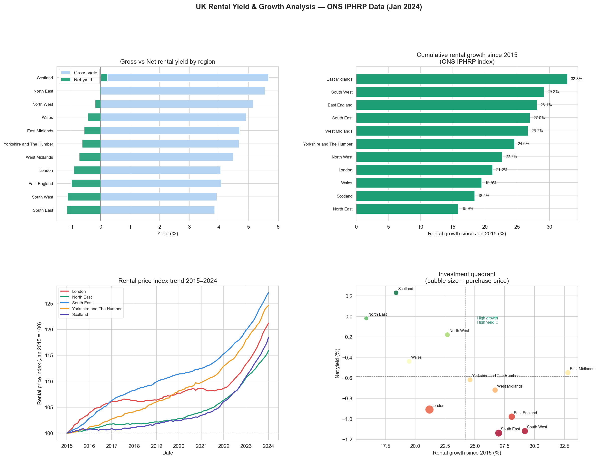

# Day 20: Real Estate Rental Yield Calculator

**Industry:** Real Estate / Finance  
**Format:** Jupyter Notebook (.ipynb)  
**Skills:** pandas · openpyxl · matplotlib · seaborn · financial modelling

## Who uses this
A buy-to-let investor shortlisting UK regions before making
purchase offers — ranking regions by gross and net yield using
real government rental data combined with a full expense model.

## Problem
Investors calculate rental yield manually in spreadsheets one
property at a time. This notebook processes official ONS data
across all UK regions, models realistic expenses, and ranks
investment hotspots automatically.

## Data
ONS Index of Private Housing Rental Prices (IPHRP)  
Official UK government statistics · Jan 2015 – Jan 2024  
Monthly rental price indices by UK region

## Expense Model (ARLA Propertymark guidelines)
- Mortgage interest: 4.5% on 75% LTV
- Agent fees: 10% of annual rent
- Maintenance: 1% of property value
- Void periods: 4 weeks/year
- Insurance + fixed costs: £800/year

## Key Findings
- Regions analysed: 11 | Data period: Jan 2015 – Jan 2024
- Only 1/11 regions achieves positive net yield at 4.5% mortgage rates
- Best region: Scotland (gross 5.68%, net 0.23%)
- Worst region: South East (gross 3.86%, net -1.14%)
- Highest rental growth since 2015: East Midlands (+32.8%)
- 3-year avg annual rental growth: 3.5% across all regions

## Critical Insight
At current mortgage rates (4.5%), UK buy-to-let is cash-flow
negative in 10 of 11 regions. Northern regions (Scotland,
North East, North West) are closest to breakeven due to lower
purchase prices relative to rents. London has the worst net
yield despite highest rents — purchase price destroys returns.

## Output


## How to run
```bash
pip install -r requirements.txt
# Place ONS Excel file in folder (downloaded from ons.gov.uk)
jupyter notebook analysis.ipynb
```