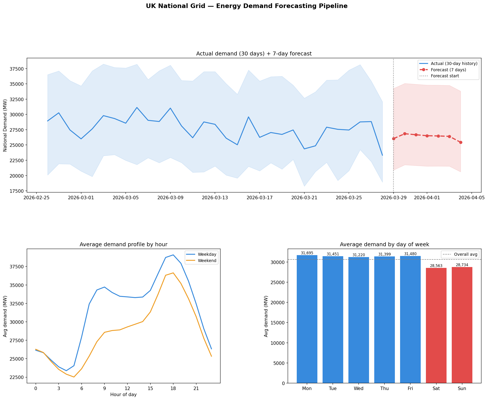

# Day 21: Energy Demand Forecasting Pipeline

**Industry:** Energy / Utilities  
**Format:** Python script (.py)  
**Skills:** ETL · pandas · numpy · time series · linear trend forecasting · matplotlib

## Who uses this
A grid operations analyst planning generation capacity for the
next 7 days — using real half-hourly National Grid demand data
to forecast when peak capacity will be needed.

## Problem
Grid operators need demand forecasts to avoid overproduction and
underproduction. Most teams lack a clean reproducible pipeline
that goes from raw half-hourly readings to a 7-day forecast
with accuracy metrics.

## Data
UK National Grid ESO — Historic Demand Data  
Real half-hourly settlement period demand readings (MW)  
Source: data.nationalgrideso.com (live, no login required)  
4,176 readings · Jan 2026 – Mar 2026

## Model
Per-period linear trend + day-of-week adjustment  
- 48 models fitted (one per half-hour settlement period)
- Training window: last 90 days of available data
- Day-of-week adjustment applied to each forecast period
- Forecast horizon: 7 days (336 half-hour slots)

## Key Findings
- Avg national demand: 30,643 MW | Peak: 47,382 MW
- Model MAPE: 7.24% | MAE: 1,819 MW | RMSE: 2,486 MW
- Peak demand hour: 18:00 (evening cooking + heating)
- Trough demand hour: 04:00
- Weekdays 9.8% higher demand than weekends
- Highest forecast day: Monday 30 Mar (35,070 MW peak)
- Lowest forecast day: Saturday 04 Apr (20,615 MW min)

## 7-Day Forecast
| Date | Day | Mean MW | Peak MW |
|------|-----|---------|---------|
| 29 Mar | Sun | 26,045 | 34,247 |
| 30 Mar | Mon | 26,842 | 35,070 |
| 31 Mar | Tue | 26,677 | 34,933 |
| 01 Apr | Wed | 26,517 | 34,798 |
| 02 Apr | Thu | 26,479 | 34,788 |
| 03 Apr | Fri | 26,411 | 34,747 |
| 04 Apr | Sat | 25,445 | 33,807 |

## Output


## How to run
```bash
pip install -r requirements.txt
python download.py    # fetches live data from National Grid ESO
python pipeline.py
```