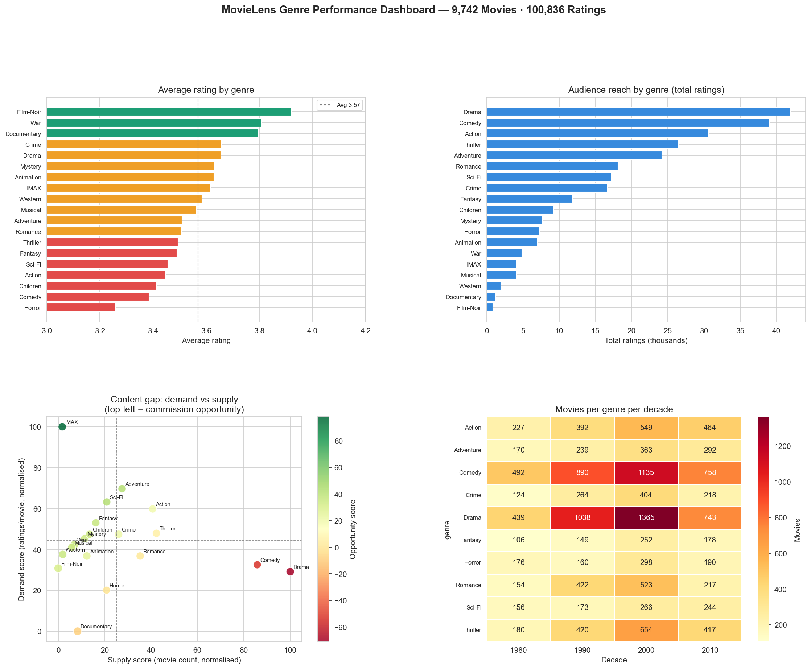

# Day 22: Media Content Genre SQL Ranker

**Industry:** Media / Entertainment  
**Format:** Jupyter Notebook (.ipynb)  
**Skills:** pandas · SQLite · SQL window functions · matplotlib · seaborn

## Who uses this
A streaming platform content team deciding genre commissioning budget — ranking genres by rating quality, audience reach, engagement, and content gap opportunity.

## Data
MovieLens Small Dataset — GroupLens Research, UMN  9,742 movies · 100,836 ratings · 610 users · 19 genres  
Year range: 1902–2018  
Source: files.grouplens.org (direct download, no login)

## SQL Approach
All analysis runs through SQLite with window functions:
- `RANK() OVER (ORDER BY avg_rating DESC)` — quality rank
- `RANK() OVER (ORDER BY total_ratings DESC)` — reach rank
- `RANK() OVER (ORDER BY ratings_per_movie DESC)` — engagement rank
- Composite rank = average of the three

## Key Findings

**Top rated genres:** Film-Noir (3.920) · War (3.808) · Documentary (3.798)

**Biggest audiences:** Drama (41,928 ratings) · Comedy (39,053) · Action (30,635)

**Most engaging (ratings/movie):** IMAX (26.2) · Adventure (19.1) · Sci-Fi (17.6)

**Lowest rated:** Horror (3.258) · Comedy (3.385) · Children (3.413)

## Top Commissioning Opportunities
High demand relative to supply — underserved genres:

| Genre | Opportunity Score |
|-------|------------------|
| IMAX | +98.3 |
| Sci-Fi | +42.3 |
| Adventure | +42.2 |
| Fantasy | +36.8 |
| Western | +35.7 |

## Insight
IMAX content has the highest engagement per movie by far (26.2ratings/movie vs 19.1 for Adventure) but extremely low supply.
Sci-Fi and Adventure have strong demand but Drama and Comedydominate production volume — classic content gap pattern.

## Output


## How to run
```bash
pip install -r requirements.txt
python download.py    # fetches MovieLens zip from grouplens.org
jupyter notebook analysis.ipynb
```