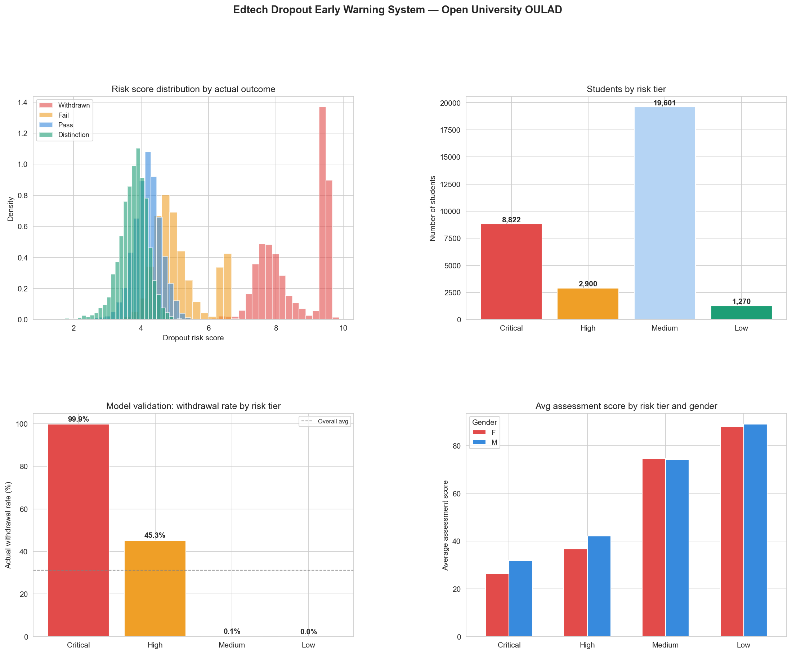

# Day 23: Edtech Dropout Early Warning System

**Industry:** Education / Edtech  
**Format:** Jupyter Notebook (.ipynb)  
**Skills:** pandas · SQLite · scoring models · matplotlib · seaborn · feature engineering

## Who uses this
An online course instructor deciding which students to personally
reach out to this week — before they quietly disappear.

## Problem
Online courses have 90%+ dropout rates. Platforms need early
behavioural signals to intervene before students disengage
completely. This system scores every student on dropout risk
using real VLE activity, assessment scores, and registration data.

## Data
Open University Learning Analytics Dataset (OULAD)  
Real anonymised student data — Open University UK  
32,593 students · 7 modules · VLE activity logs · assessment scores  
Source: analyse.kmi.open.ac.uk (direct download, no login)

## Risk Signals (weighted composite score)
| Signal | Weight | Logic |
|--------|--------|-------|
| Unregistered | 30% | Dropped out = max risk |
| VLE engagement (clicks) | 25% | Low activity = risk |
| Assessment score | 20% | Low grades = risk |
| Submission rate | 10% | Missing work = risk |
| Active days | 8% | Inactivity = risk |
| Prior attempts | 4% | Repeat failures = risk |
| Deprivation index | 3% | Socioeconomic risk |

## Key Findings
- Overall withdrawal rate: 31.2%
- Critical tier (8,822 students): 99.9% actual withdrawal rate
- High tier (2,900 students): 45.3% actual withdrawal rate
- Medium tier (19,601 students): 0.1% actual withdrawal rate
- Low tier (1,270 students): 0.0% actual withdrawal rate
- Model is 3.2x more predictive than baseline in critical tier
- 11,722 students flagged for immediate outreach
- Highest risk module: CCC | Lowest risk: GGG

## Critical Insight
Students who never submitted an assessment are near-certain
dropouts. VLE click engagement is the strongest early signal —
detectable weeks before formal withdrawal.

## Output


## How to run
```bash
pip install -r requirements.txt
python download.py    # fetches OULAD zip from open.ac.uk
jupyter notebook analysis.ipynb
```