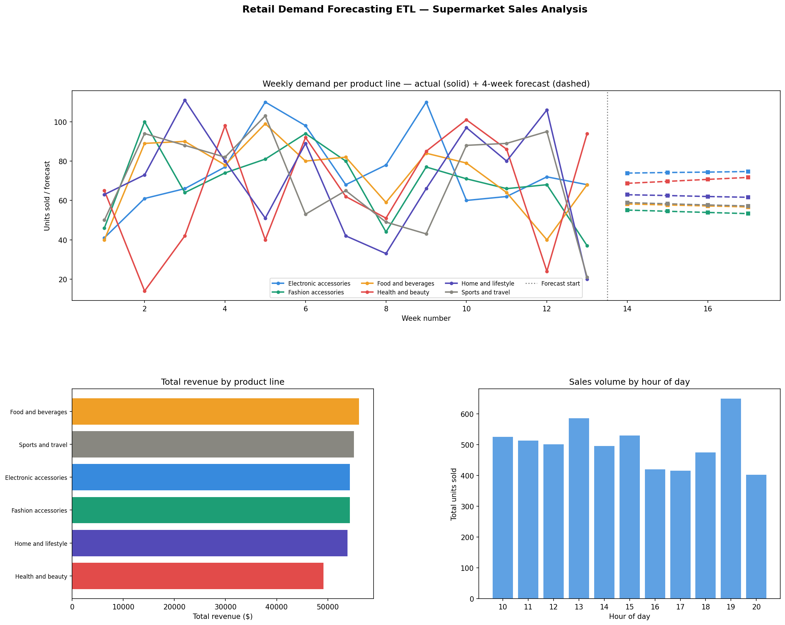

# Day 24: Retail Demand Forecasting ETL

**Industry:** Retail / E-commerce  
**Format:** Python script (.py)  
**Skills:** ETL · pandas · numpy · SQLite · demand forecasting · matplotlib

## Who uses this
A supply chain planner deciding stock orders for the next 4 weeks
— processing transaction history to forecast demand per product
line and flag overstock/understock risk automatically.

## Problem
Retailers overstock slow lines and understock fast movers because
demand signals aren't processed into forecasts fast enough. This
pipeline goes from raw transactions to a 4-week forward order
plan in one run.

## Data
Supermarket Sales Dataset — 3 branches, 6 product lines  
1,000 real transactions · Jan–Mar 2019  
Source: github.com/sushantag9/Supermarket-Sales-Data-Analysis

## Pipeline
1. **Extract** — load raw transaction CSV
2. **Transform** — parse dates, engineer time features, weekly aggregation
3. **Load** — SQLite (transactions, weekly_demand, demand_forecast tables)
4. **Forecast** — blended trend + rolling average per product line
5. **Flag** — overstock/understock risk per week

## Forecast Model
- Linear trend fitted on 12 weeks of weekly quantity data
- Blended: 40% trend + 60% rolling 2-week average
- 20% safety stock buffer added to order quantity

## Key Findings
- Transactions: 1,000 | Revenue: $322,966.75 | Profit: $15,379.37
- Avg transaction value: $322.97
- Top product line: Food & Beverages ($56,144.84)
- Lowest product line: Health & Beauty ($49,193.74)
- Top branch: C — Naypyitaw ($110,568.71)
- Peak sales hour: 19:00 (evening shopping)
- Top payment method: Cash (344 transactions)
- Stock flags raised: 0 — all lines within normal range

## 4-Week Demand Forecast
| Product Line | Avg Units/Week |
|---|---|
| Electronic accessories | 74 |
| Health and beauty | 70 |
| Home and lifestyle | 62 |
| Food and beverages | 57 |
| Sports and travel | 58 |
| Fashion accessories | 54 |

## Output


## How to run
```bash
pip install -r requirements.txt
python download.py      # fetches sales data
python etl_pipeline.py
```