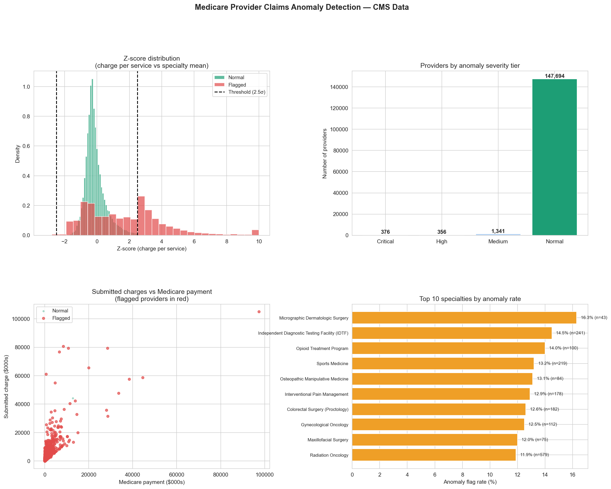

# Day 25: Healthcare Claims Anomaly Detector

**Industry:** Healthcare  
**Format:** Jupyter Notebook (.ipynb)  
**Skills:** pandas · numpy · Z-score detection · matplotlib · seaborn

## Who uses this
An insurance fraud analyst deciding which Medicare providers
to flag for manual review — surfacing statistical outliers
before they become billion-dollar fraud cases.

## Problem
Billing fraud and errors cost Medicare billions annually.
Manual review of 1.2M+ providers is impossible. Z-score
detection within specialty peer groups flags the statistically
anomalous providers automatically.

## Data
CMS Medicare Physician & Other Practitioners — by Provider  
149,767 real US Medicare providers · 82 specialties · 59 states  
Source: data.cms.gov live API (no login required)

## Fraud Signals Detected
| Signal | Description |
|--------|-------------|
| Charge per service | Inflated billing per procedure |
| Services per beneficiary | Upcoding / unnecessary procedures |
| Charge-to-payment ratio | Overbilling vs Medicare allowance |
| Payment per beneficiary | Total Medicare spend per patient |
| Allowed per service | Medicare-assessed fair value |

## Method
Z-score calculated per provider **within their specialty peer
group** — avoiding unfair penalisation of high-cost specialties.
Threshold: Z > 2.5 on any signal = flagged.

## Key Findings
- Providers analysed: 149,767 across 82 specialties
- Total flagged: 8,523 (5.7% of all providers)
- Critical severity: 376 | High severity: 356
- Flagged providers submitted **$9.9 billion** in charges
- Highest anomaly: Aaron Jeng, Internal Medicine, CA
  - Submitted charge: $58,724,301
  - Anomaly score: 26.4σ (4 signals flagged)
- Highest risk specialty: Micrographic Dermatologic Surgery (16.3%)

## Key Insight
Charge-to-payment ratio is the single most discriminating
fraud signal. Legitimate providers cluster tightly around
their specialty mean — outliers at 26σ warrant immediate
investigation regardless of specialty norms.

## Output


## How to run
```bash
pip install -r requirements.txt
python download.py    # fetches 15k rows from CMS API
jupyter notebook analysis.ipynb
```