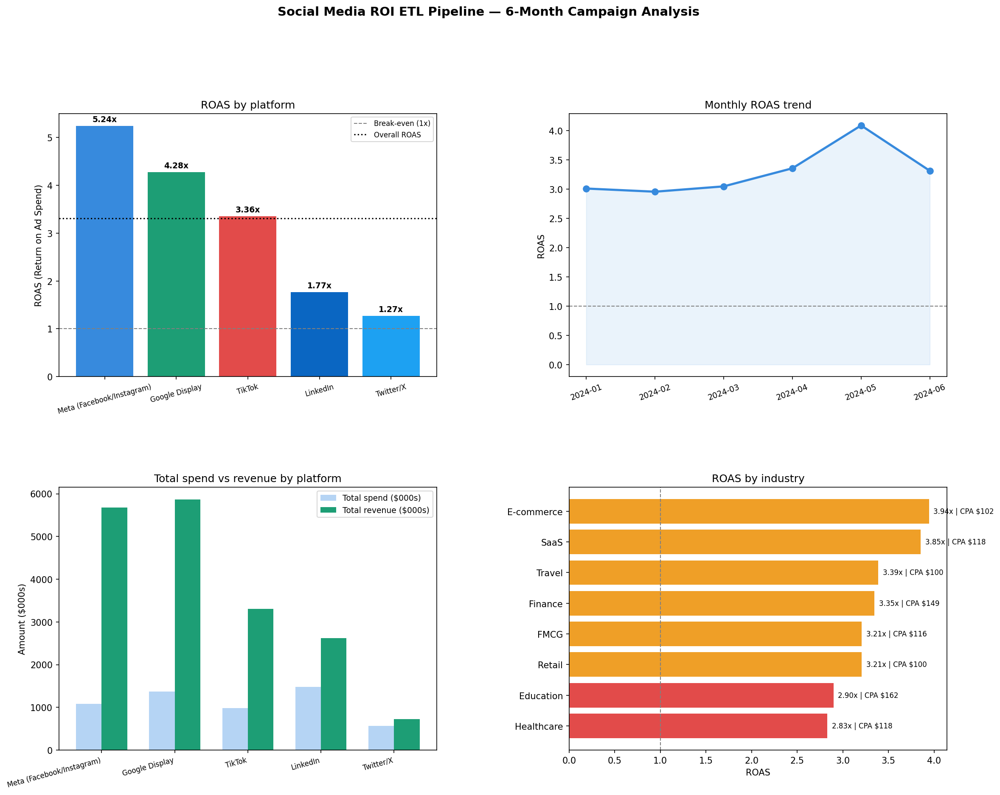

# Day 26: Social Media ROI ETL Pipeline

**Industry:** Marketing / Digital Media  
**Format:** Python script (.py)  
**Skills:** ETL · pandas · numpy · SQLite · matplotlib · marketing analytics

## Who uses this
A digital marketing manager presenting the monthly social media
performance report to the CMO — with platform ROI rankings and
concrete budget reallocation recommendations.

## Problem
Marketing teams track spend and impressions but rarely calculate
true ROAS and CPA per platform in one automated pipeline.
This script processes all campaign data, loads into SQLite,
and outputs a ranked ROI report in one run.

## Data
Synthetic — mirrors real ad platform export schema  
(Meta Ads Manager, LinkedIn Campaign Manager, Twitter/X Ads,  
TikTok Ads, Google Display)  
458 campaigns · 5 platforms · 8 industries · 6 months

## KPIs Calculated
| Metric | Formula |
|--------|---------|
| ROAS | Revenue / Spend |
| CTR | Clicks / Impressions |
| Conversion Rate | Conversions / Clicks |
| CPA | Spend / Conversions |
| CPC | Spend / Clicks |
| Engagement Rate | Engagements / Impressions |
| ROI % | (Revenue - Spend) / Spend × 100 |

## Key Findings
- Campaigns: 458 | Total spend: $5.49M | Total revenue: $18.2M
- Overall ROAS: 3.31x | Total profit: $12.7M
- Best platform: Meta (5.24x ROAS, CTR 1.64%, CPA $28)
- Worst platform: Twitter/X (1.27x ROAS, CPA $85)
- LinkedIn: lowest ROAS (1.77x) but highest CPA ($382) — B2B premium
- Best campaign type: Brand Awareness (3.58x ROAS)
- Best industry: E-commerce (3.94x ROAS)
- Best month: May 2024 (4.09x) | Worst: Feb 2024 (2.95x)

## Budget Reallocation
1. Increase Meta budget — 5.24x ROAS, lowest CPA at $28
2. Reduce Twitter/X — 1.27x barely above break-even
3. Shift mix toward Brand Awareness campaigns
4. Prioritise E-commerce vertical — strongest returns

## Output


## How to run
```bash
pip install -r requirements.txt
python etl_pipeline.py
```