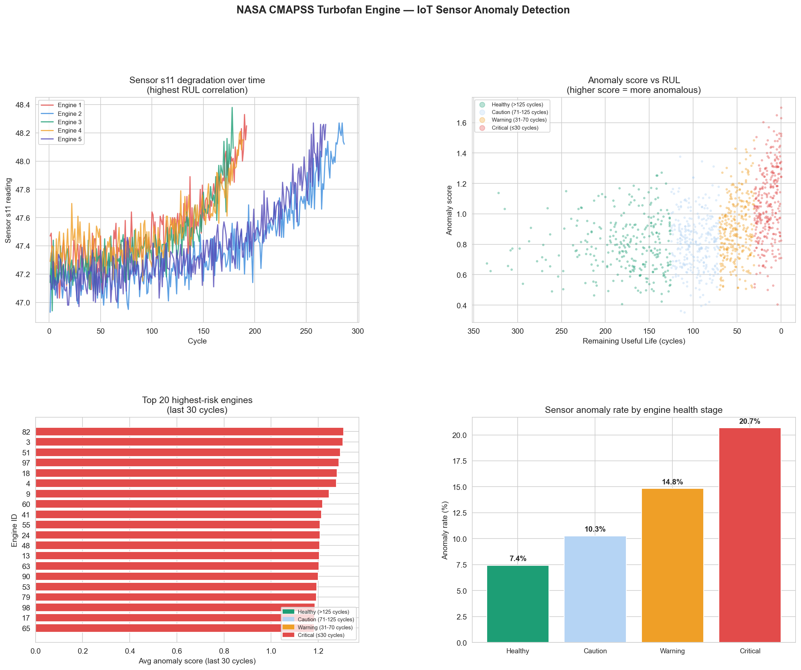

# Day 27: IoT Sensor Anomaly Detector

**Industry:** Energy / Aerospace / Manufacturing  
**Format:** Jupyter Notebook (.ipynb)  
**Skills:** pandas · numpy · rolling Z-score · matplotlib · seaborn · predictive maintenance

## Who uses this
A predictive maintenance engineer monitoring a fleet of industrial
turbofan engines — detecting degradation signals before failure
using real NASA sensor data.

## Problem
Industrial engines generate thousands of sensor readings per cycle.
Manual monitoring is impossible at scale. Rolling Z-score anomaly
detection flags statistically unusual readings automatically,
enabling proactive maintenance scheduling.

## Data
NASA CMAPSS Turbofan Engine Degradation Dataset (FD001)  
Real run-to-failure simulation data from NASA Ames  
100 engines · 21 sensors · 20,631 cycle readings  
Source: phm-datasets.s3.amazonaws.com (direct download, no login)

## Method
- Rolling Z-score (30-cycle window) per sensor per engine
- Threshold: Z > 2.5 = anomalous reading
- 11/21 sensors selected (constant sensors excluded)
- Composite anomaly score = mean absolute Z across all sensors
- RUL = max cycle − current cycle (run-to-failure known)

## Key Findings
- Engines monitored: 100 | Sensor readings: 20,631
- Informative sensors: 11/21 (10 sensors constant, excluded)
- Overall anomaly rate: 11.6%
- Critical stage anomaly rate: 20.7% — nearly 2x baseline
- Best degradation predictor: Sensor s11 (RUL correlation r=0.696)
- Highest risk engine: Engine 82 (avg anomaly score 1.307)

## Key Insight
Sensor s11 (High Pressure Compressor outlet temperature) is the
strongest single predictor of remaining engine life at r=0.696.
Anomaly rate nearly doubles from baseline (11.6%) to critical
stage (20.7%) — confirming the detector captures real degradation
signal, not noise.

## Output


## How to run
```bash
pip install -r requirements.txt
python download.py    # fetches NASA CMAPSS zip
jupyter notebook analysis.ipynb
```